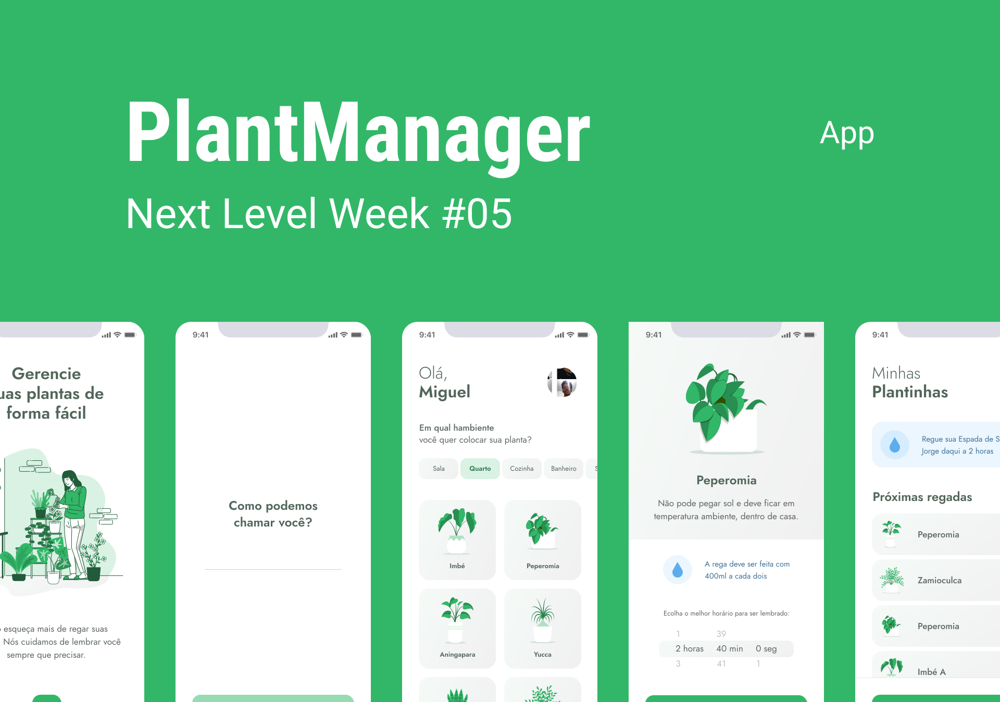

<h1 align="center">
  
</h1>

 

  

## 🌍 Experimente agora
[PlantManager](https://expo.dev/@lmiguelm/PlantManager)

## ✨ Tecnologias

Esse projeto foi desenvolvido com as seguintes tecnologias:

- [React Native](https://reactnative.dev/)
- [Typescript](https://www.typescriptlang.org/)
- [Expo](https://expo.io/)

## 💻 Projeto

Aplicativo para lhe ajudar a lembrar de cuidar de suas plantas de forma fácil de acordo com cada tipo de plantinha.

## 🔖 Layout

Você pode visualizar o layout do projeto através [desse link](https://www.figma.com/file/IhQRtrOZdu3TrvkPYREzOy/PlantManager/duplicate). É necessário ter conta no [Figma](http://figma.com/) para acessá-lo.

## 🚀 Como executar

- Clone o repositório
- Instale as dependências com `yarn`
- Inicie seu app com `expo start`
- Inicie a fake api com `yarn server`. Substitua o host pelo seu endereço IP local. Faça o mesmo no arquivo API dentro de services.
